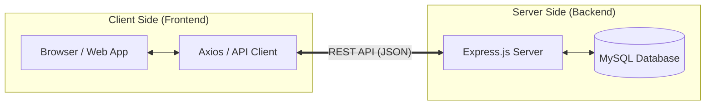
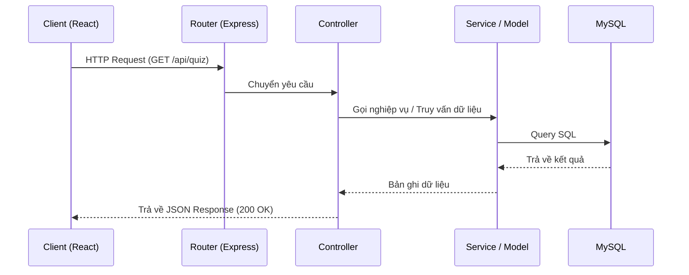
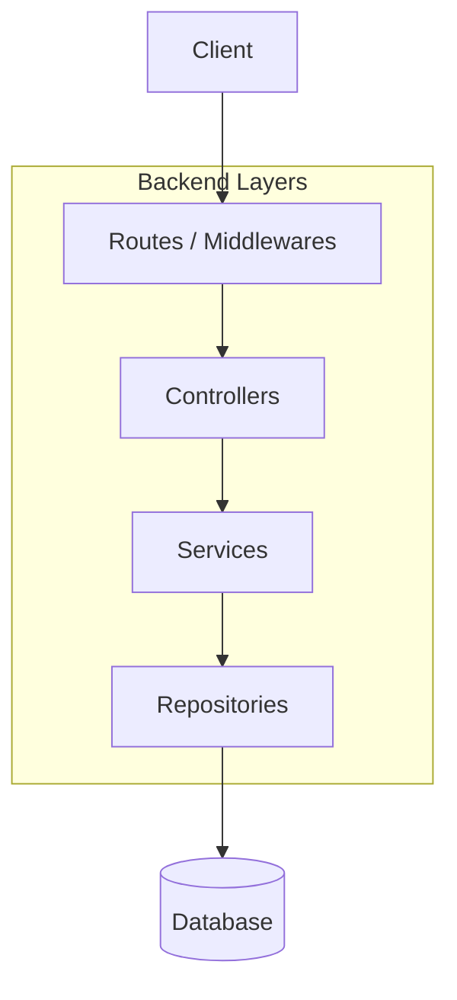

# Kiến trúc Hệ thống FireQuiz

Tài liệu này mô tả chi tiết kiến trúc của hệ thống FireQuiz dựa trên ba thành phần chính: **Client-Server Architecture**, **REST API**, và **MVC Pattern**.

## 1. Mô hình Client-Server (Kiến trúc Khách - Chủ)

Hệ thống được chia thành hai phần tách biệt: **Frontend (Client)** và **Backend (Server)**.

- **Frontend (Client)**: Xây dựng bằng React (Vite). Đây là nơi xử lý giao diện người dùng (UI), trải nghiệm người dùng (UX) và gửi yêu cầu đến server.
- **Backend (Server)**: Xây dựng bằng Node.js & Express. Xử lý logic nghiệp vụ, quản lý cơ sở dữ liệu và bảo mật.

---

## 2. REST API (Giao diện lập trình ứng dụng)

Sự giao tiếp giữa Client và Server được thực hiện thông qua các Endpoint chuẩn RESTful.

- **Phương thức HTTP**:
  - `GET`: Lấy dữ liệu (ví dụ: Lấy danh sách câu hỏi).
  - `POST`: Tạo mới dữ liệu (ví dụ: Đăng ký, tạo đề thi).
  - `PUT / PATCH`: Cập nhật dữ liệu.
  - `DELETE`: Xóa dữ liệu.
- **Định dạng dữ liệu**: Sử dụng **JSON** để trao đổi thông tin.
- **Stateless**: Mỗi request từ Client đều chứa đủ thông tin để Server xử lý (thường đi kèm JWT Token trong Header hoặc Cookie).

---

## 3. MVC Pattern (Mô hình Model-View-Controller)

Hệ thống áp dụng mô hình MVC để tổ chức mã nguồn Backend một cách khoa học và dễ bảo trì. Trong ngữ cảnh của một REST API, thành phần "View" chính là dữ liệu JSON được trả về.

### Cấu trúc thực tế trong FireQuiz:

| Thành phần | Vai trò | Vị trí trong Code |
| :--- | :--- | :--- |
| **Model** | Đại diện cho cấu trúc dữ liệu và logic nghiệp vụ chính. Bao gồm kết nối Database và định nghĩa bảng. | `backend/src/db`, `backend/src/repositories`, `backend/src/services` |
| **View** | Giao diện hiển thị cho người dùng. Với Backend API, View là các phản hồi JSON. Với hệ thống tổng thể, View là React components. | `frontend/src/components`, JSON Responses |
| **Controller** | Điều phối luồng xử lý. Tiếp nhận yêu cầu từ Routes, gọi Model/Service và trả về View. | `backend/src/controllers` |

### Luồng xử lý một Request (Data Flow):

1. **Route**: `app.js` nhận request và chuyển hướng đến Route tương ứng (ví dụ: `/api/quiz`).
2. **Controller**: Route gọi hàm trong Controller để xử lý logic điều hướng.
3. **Service / Repository (Model)**: Controller gọi Service để xử lý logic nghiệp vụ phức tạp hoặc gọi Repository để truy vấn database MySQL.
4. **Response (View)**: Dữ liệu được trả về dưới dạng JSON cho Client qua HTTP Response.

---

## 4. Mô hình tách lớp (Layered Architecture)

Hệ thống Backend được thiết kế theo cấu trúc phân lớp rõ ràng để đảm bảo tính **Loose Coupling** (ghép nối lỏng lẻo) và **High Cohesion** (tính gắn kết cao).

- **Presentation Layer (Lớp trình diễn)**: 
    - Bao gồm `Routes` và `Controllers`.
    - Nhiệm vụ: Tiếp nhận yêu cầu HTTP, kiểm tra tham số đầu vào cơ bản (Validation) và trả về phản hồi cho người dùng.
- **Business Logic Layer (Lớp nghiệp vụ)**: 
    - Bao gồm `Services`.
    - Nhiệm vụ: Xử lý các quy tắc nghiệp vụ tập trung, tính toán, và phối hợp các Repository.
- **Data Access Layer (Lớp truy cập dữ liệu)**: 
    - Bao gồm `Repositories`.
    - Nhiệm vụ: Thực hiện các câu lệnh SQL trực tiếp để tương tác với MySQL. Cách ly logic nghiệp vụ khỏi chi tiết của Database.
- **Infrastructure Layer (Lớp hạ tầng)**:
    - Bao gồm `db` config, `utils`, `middlewares`.

---

## 5. Tổng kết công nghệ sử dụng

- **Frontend**: React, Vite, TailwindCSS/CSS Vanilla, Axios (Client).
- **Backend**: Express.js (Controller/Router), Node.js.
- **Database**: MySQL (Model).
- **Authentication**: JWT & Cookie-based (Middleware).
